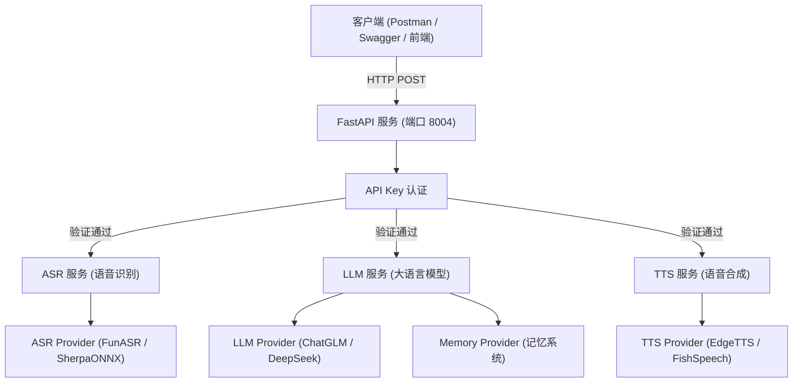

# 小智 AI FastAPI 服务

基于 FastAPI 重构的独立问答服务，分离 ASR/TTS/LLM 业务逻辑，移除 ESP32 硬件依赖。

## 系统架构



## 目录结构

```text
xiaozhi-server/
├── api/                    # FastAPI 应用层
│   ├── app.py              # 应用入口、生命周期管理
│   ├── auth.py             # API Key 认证
│   ├── dependencies.py     # 服务容器（依赖注入）
│   ├── routes/
│   │   ├── ask.py          # /ask 问答接口
│   │   └── health.py       # /health 健康检查
│   └── schemas/
│       ├── request.py      # 请求模型
│       └── response.py     # 响应模型
├── services/               # 业务逻辑层
│   ├── asr_service.py      # ASR 语音识别服务
│   ├── llm_service.py      # LLM 对话服务
│   └── tts_service.py      # TTS 语音合成服务
├── core/providers/         # Provider 实现层（复用原有代码）
│   ├── asr/                # ASR 提供者
│   ├── llm/                # LLM 提供者
│   └── tts/                # TTS 提供者
├── app_fastapi.py          # 启动脚本
└── config.yaml             # 配置文件
```

## 快速开始

### 环境要求

- Python 3.10+
- ffmpeg（`conda install -c conda-forge ffmpeg`）

### 安装依赖

```bash
conda create -n xiaozhi-server python=3.10
conda activate xiaozhi-server
pip install -r requirements.txt
pip install fastapi uvicorn[standard] python-multipart
```

### 启动服务

### 启动服务

```bash
cd main/xiaozhi-server
python app_fastapi.py
```

### 启动成功示例

```text
╔═══════════════════════════════════════════════════════════════╗
║                    小智 AI FastAPI 服务                       ║
╠═══════════════════════════════════════════════════════════════╣
║  模式:  开发模式                                               ║
║  地址: http://0.0.0.0:8004                                     ║
║  文档: http://localhost:8004/docs                              ║
║  Workers: 1                                                   ║
╚═══════════════════════════════════════════════════════════════╝

INFO:     Will watch for changes in these directories: ['D:\Programming\Python\PythonProjects\xiaozhi-esp32-server\main\xiaozhi-server']
INFO:     Uvicorn running on http://0.0.0.0:8004 (Press CTRL+C to quit)
INFO:     Started reloader process [10152] using WatchFiles
INFO:     Started server process [27312]
INFO:     Waiting for application startup.
261008 18:23:52[0.9.7_00000000000000][core.utils.modules_initialize]-INFO-初始化组件: tts成功 EdgeTTS
261008 18:23:55[0.9.7_00000000000000][core.utils.modules_initialize]-INFO-初始化组件: llm成功 ChatGLMLLM
261008 18:23:55[0.9.7_00000000000000][core.utils.modules_initialize]-INFO-初始化组件: memory成功 nomem
261008 18:24:34[0.9.7_00000000000000][core.providers.asr.fun_local]-INFO-funasr version: 1.2.7.
261008 18:24:34[0.9.7_00000000000000][core.utils.modules_initialize]-INFO-ASR模块初始化完成
261008 18:24:34[0.9.7_00000000000000][core.utils.modules_initialize]-INFO-初始化组件: asr成功 FunASR
261008 18:24:34[0.9.7_00000000000000][api.dependencies]-INFO-服务容器初始化完成
261008 18:24:34[0.9.7_00000000000000][api.app]-INFO-FastAPI 服务启动成功
261008 18:24:34[0.9.7_00000000000000][api.app]-INFO-API 文档地址: http://localhost:8004/docs
261008 18:24:34[0.9.7_00000000000000][api.app]-INFO-API Key: xxxxxxxxxxxxxxxxx
```

### 访问文档

- Swagger UI: http://localhost:8004/docs
- ReDoc: http://localhost:8004/redoc


### 访问文档

- Swagger UI: http://localhost:8004/docs
- ReDoc: http://localhost:8004/redoc

## 接口说明

### POST /api/v1/ask

| 输入类型 | 输出类型 | 说明 |
|---------|---------|------|
| text | text | 文本问答 |
| audio | text | 语音识别 + 问答 |
| text | audio | 问答 + 语音合成 |
| audio | audio | 语音识别 + 问答 + 语音合成 |

## 认证方式

在请求头中添加：`Authorization: Bearer <api_key>` 或在查询参数中传递：`?api_key=<api_key>`

API Key 在服务启动日志中输出。